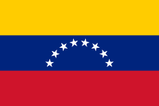

# LA BANDERA

***Éste proyecto enmarca la clase de FLOAT***
### Encontraremos 4 ramas:
'master' 'inicial' 'punto1' 'punto2'
#### master
Página final
#### inicial
Página inicial. Aquí se ha colocado las cajas de colores en orden y de forma vertical: amarillo, azul y rojo.
#### punto1
Página donde hacemos uso de float:left. Aquí se ha colocado las cajas de colores en orden y de forma horizontal: amarillo, azul y rojo.
#### punto2
Página donde hacemos uso de float:right. Aquí se colocan las cajas de colores en orden y de forma horizontal e invertida a la de punto1: rojo, azul y amarillo.
